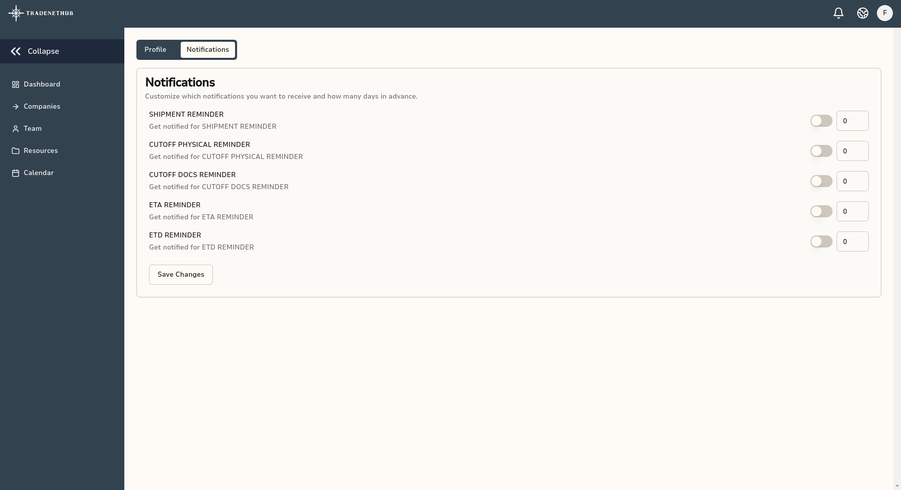

## Alerts and Reminders

TradeNetHub allows you to stay informed about important events and updates through notifications. You can receive these notifications via email and the notification bell within the platform. This guide will show you how to configure and activate the notifications you want to receive and set how many days in advance you want to be notified.

## Configuring Notifications

To configure your notifications, follow these steps:

1. **Accessing Settings**: Click on your profile icon in the top right corner and select "Settings" from the dropdown menu.

2. **Navigating to Notifications Tab**: Once in the settings, navigate to the "Notifications" tab.

3. **Activating Notifications**: Here, you can see a list of available notifications. Toggle the switch to activate the notifications you want to receive.

4. **Setting Notification Preferences**: For each activated notification, you can set how many days in advance you want to be notified by entering the number of days in the provided field.

## Types of Notifications

The available notifications you can configure include:

- **Shipment Reminder**: Get notified about upcoming shipments.
- **Cutoff Physical Reminder**: Receive alerts for physical cutoff deadlines.
- **Cutoff Docs Reminder**: Get reminders for documentary cutoff deadlines.
- **ETA Reminder**: Be alerted about the estimated time of arrival of your shipments.
- **ETD Reminder**: Receive notifications about the estimated time of departure of your shipments.

## Receiving Notifications

### Email Notifications
If you have activated email notifications, you will receive the configured notifications in your registered email address.

### Bell Notifications
You will also receive notifications via the notification bell within the platform. Click on the bell icon in the top right corner to view your unread notifications.

By configuring these notifications, you can ensure that you stay on top of important events and deadlines, helping you manage your trading and brokerage operations more effectively.

---

For more detailed information on each notification type and additional settings, refer to other sections of this guide or visit our [Help and Support](../help-and-support.md) page.
