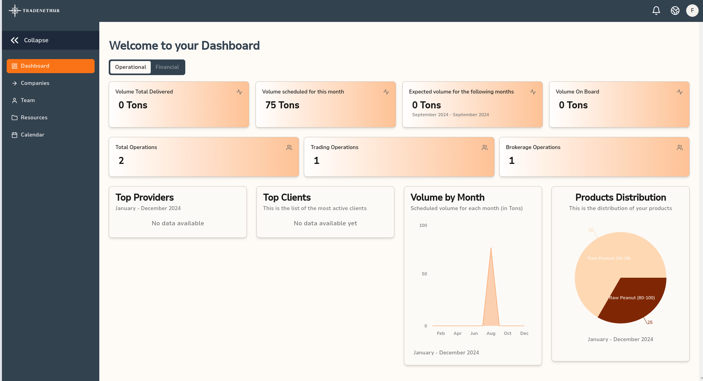

# Dashboard

Welcome to your Dashboard! The TradeNetHub dashboard provides a comprehensive overview of your operational and financial metrics, allowing you to monitor the performance and status of your trading and brokerage activities. The dashboard is divided into two main tabs: Operational and Financial.

## Operational Metrics

### Volume Total Delivered
This metric shows the total volume of goods delivered, measured in tons. It helps you track the overall quantity of products successfully delivered to their destinations.

### Volume Scheduled for This Month
This metric displays the volume of goods scheduled to be delivered within the current month. It provides a snapshot of your upcoming deliveries, helping you plan and manage logistics effectively.

### Expected Volume for the Following Months
This metric forecasts the volume of goods expected to be delivered in the upcoming months. It aids in anticipating future deliveries and preparing resources accordingly.

### Volume On Board
This metric indicates the volume of goods currently in transit, measured in tons. It gives you a real-time view of shipments that are on their way to their destinations.

### Total Operations
This metric provides the total number of operations, including both trading and brokerage activities. It offers a quick summary of all ongoing and completed operations.

### Trading Operations
This metric shows the number of trading operations specifically. It helps you focus on the trading aspect of your business, distinguishing it from brokerage activities.

### Brokerage Operations
This metric indicates the number of brokerage operations. It allows you to track the brokerage side of your business separately from trading operations.

### Top Providers
This section lists the most active providers based on the volume of goods they have supplied over the selected period (e.g., January - December 2024). It helps you identify key partners and assess their performance.

### Top Clients
This section displays the most active clients based on their transaction volume over the selected period. It helps you understand which clients are driving your business and their relative activity levels.

### Volume by Month
This chart visualizes the scheduled volume for each month in tons. It allows you to see trends and patterns in your delivery schedule over the year.

### Products Distribution
This pie chart shows the distribution of your products. It helps you visualize the proportion of different products in your overall inventory, providing insights into product variety and dominance.

## Financial Metrics

*Note: The financial metrics tab is currently under development. Detailed information on financial metrics will be added soon.*

---

By regularly monitoring these metrics, you can gain valuable insights into your business operations and make data-driven decisions to enhance your trading and brokerage activities. For more detailed information on each metric, please refer to the specific sections in this guide.
