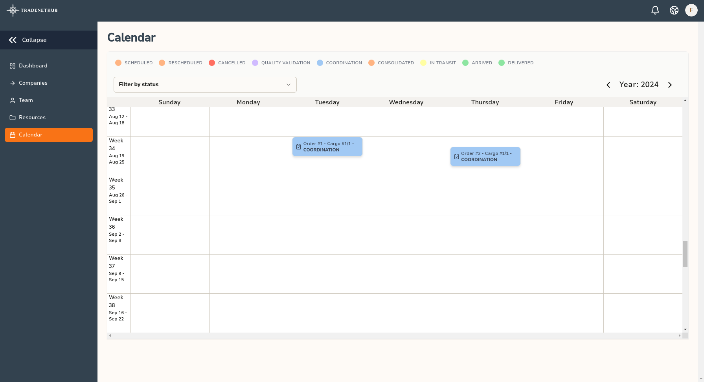

# Operational Calendar

The Operational Calendar in TradeNetHub provides a comprehensive view of all your scheduled operations, allowing you to manage and track your activities efficiently. This calendar helps you stay organized by displaying the status of each operation and enabling you to filter and navigate through them easily.

## Features

### Status Filters
You can filter your operations by their status to get a clearer view of what’s happening. The available statuses include:
- **Scheduled**: Operations that are planned and scheduled.
- **Rescheduled**: Operations that have been rescheduled.
- **Cancelled**: Operations that have been cancelled.
- **Quality Validation**: Operations undergoing quality checks.
- **Coordination**: Operations in the coordination phase.
- **Consolidated**: Operations that have been consolidated.
- **In Transit**: Goods that are currently being transported.
- **Arrived**: Goods that have arrived at their destination.
- **Delivered**: Goods that have been delivered to the final recipient.

### Viewing Details
By clicking on a specific cargo in the calendar, you will be redirected to the detailed view of that particular cargo. This detailed view provides all the necessary information and actions related to the cargo.

## How to Use the Calendar

1. **Navigate to the Calendar**: Go to the `Calendar` section from the main navigation menu on the left.

2. **Filter by Status**: Use the filter dropdown at the top of the calendar to select the status you want to view. This will update the calendar to show only the operations with the selected status.

3. **View Operation Details**: Click on any cargo entry within the calendar. This will redirect you to the detailed view of the selected cargo, where you can see all relevant information and take necessary actions.

### Example Workflow

1. **Checking Scheduled Operations**: Start by selecting the "Scheduled" filter to see all operations that are planned for the upcoming days.

2. **Monitoring In Transit Goods**: Switch to the "In Transit" filter to track the progress of your shipments currently on the way.

3. **Reviewing Completed Deliveries**: Finally, select the "Delivered" filter to review all the goods that have successfully reached their destination.

By utilizing these filters and features, you can maintain a well-organized and efficient operational workflow, ensuring that all aspects of your trading and brokerage activities are managed effectively.

---

For further assistance, please refer to other sections of this guide or visit our [Help and Support](../help-and-support.md) page.
