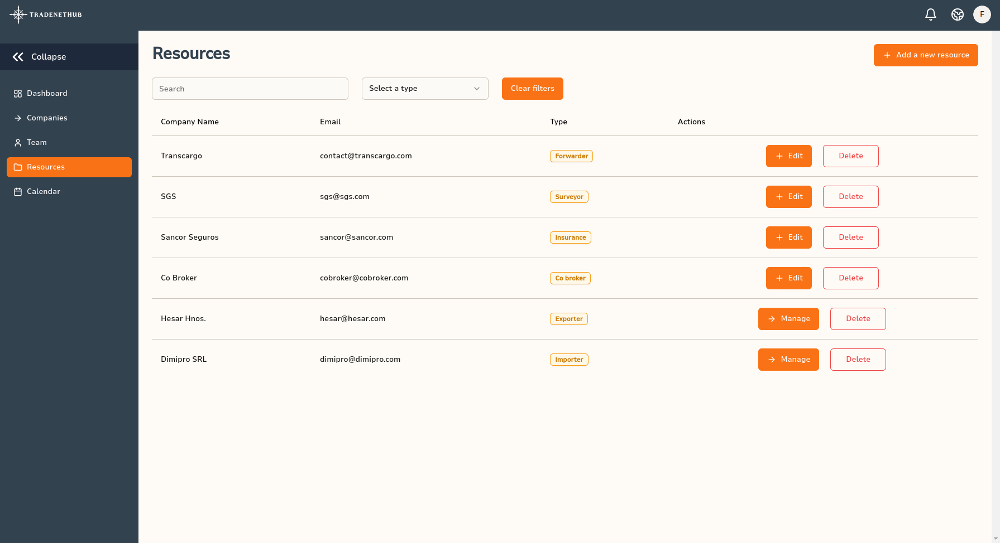
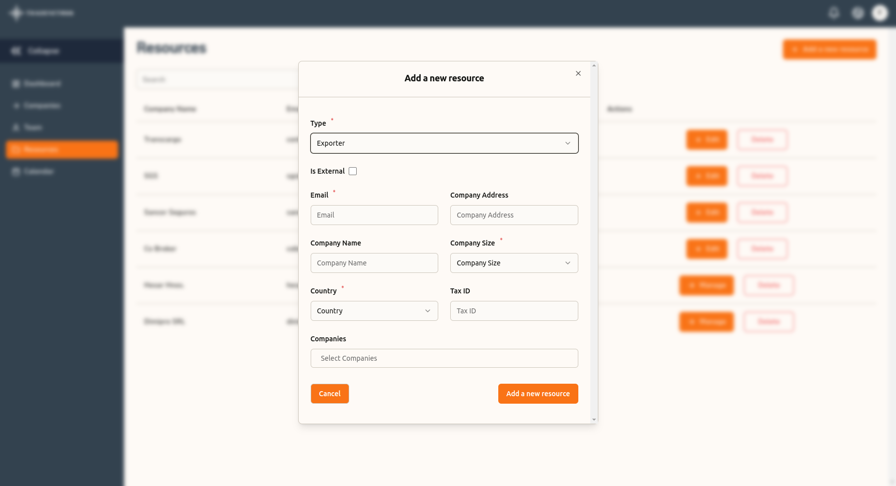
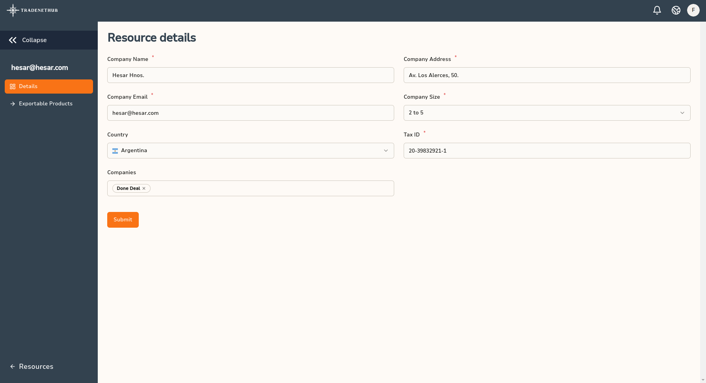
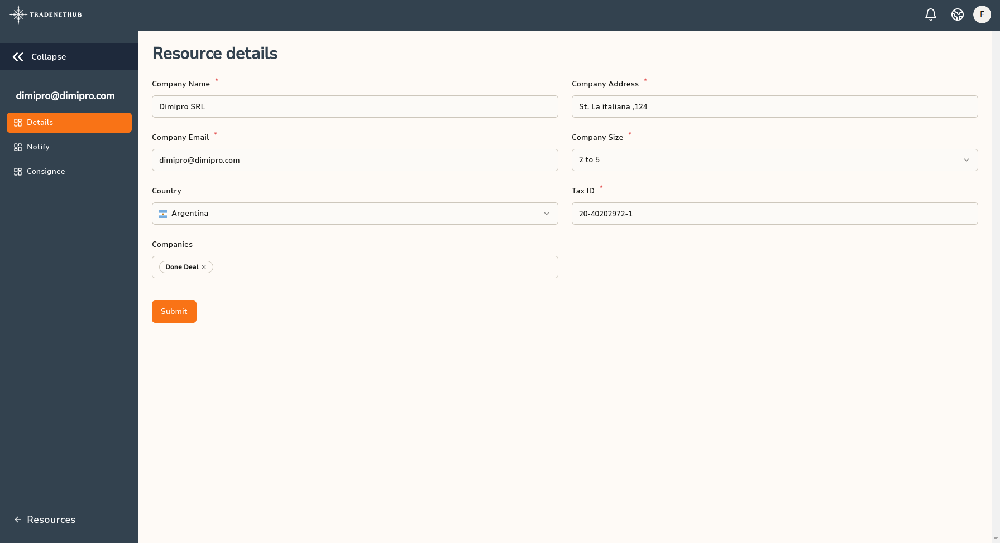

# Resources Management

The Resources section in TradeNetHub allows you to manage all the entities you interact with daily, such as forwarders, insurers, exporters, importers, co-brokers, surveyors, and shipping lines. This section helps you keep detailed and updated records of each resource, making your operations more efficient.

## Adding a New Resource

To add a new resource, follow these steps:

1. **Navigate to the Resources Section**: Go to the `Resources` section from the main navigation menu on the left.

2. **Click on "Add a New Resource"**: Press the orange button labeled "Add a new resource" at the top right of the screen.

3. **Select the Resource Type**: A modal will appear prompting you to select the type of resource you want to add. The available types include:
   - Surveyor
   - Forwarder
   - Insurance
   - Shipping Line
   - Exporter
   - Importer
   - Co-broker

4. **Fill in the Resource Details**: After selecting the resource type, fill in the required details in the form. The fields include:
   - **Type**: Automatically populated based on your selection.
   - **Is External**: Checkbox to indicate if the resource is external.
   - **Email**: Contact email for the resource.
   - **Company Name**: Name of the resource company.
   - **Company Size**: Size of the company.
   - **Company Address**: Address of the resource company.
   - **Country**: Country where the resource is located.
   - **Tax ID**: Tax identification number of the resource.
   - **Companies**: Select the companies that this resource is associated with.

5. **Save the Resource**: Once all the information is filled in, click on the "Add a new resource" button to save the resource.

## Managing Existing Resources

### Editing and Deleting Resources
In the Resources section, you can edit or delete existing resources. Each resource listed includes options for:
- **Edit**: Modify the details of the resource.
- **Delete**: Remove the resource from the list.

### Managing Specific Resources
For importers and exporters, additional management options are available:
- **Exporters**: Click on "Manage" to handle exportable products associated with the exporter.
- **Importers**: Click on "Manage" to create and manage "Notify" and "Consignee" details for the importer.

### Resource Details
When managing a resource, you can view and edit detailed information, including company name, email, address, size, country, tax ID, and associated companies.

### Filtering Resources
You can filter the resources displayed by type using the filter dropdown at the top of the list. This helps you quickly find and manage specific types of resources.

---

By effectively managing your resources, you can ensure smoother operations and better coordination with all entities involved in your trading and brokerage activities. For more detailed information on each resource type and their specific management options, refer to the respective sections in this guide or visit our [Help and Support](../help-and-support.md) page.
